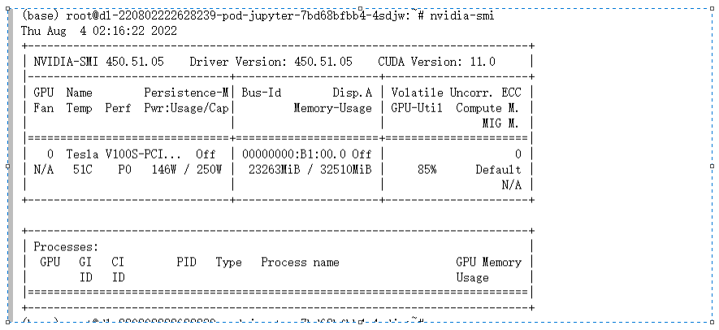

## Backgroud
1. 受到[原bilibili](https://www.bilibili.com/video/BV1rV4y177Z7?spm_id_from=333.999.0.0)视频启发，打算自己动手训练tts模型，但无法解决依赖问题，故寻找新的解决方案
> 本项目没有任何优化升级，单纯的解决依赖问题。原demo只是将代码风格优化，并修改了几个接口
2. 测试平台为linux+n卡，windows由于无本地环境无法测试。~~(没有显卡，全靠白嫖)~~
3. 基本环境 conda + python3.9

## Target
> 只针对Tacotron2的问题, vecoder部分未处理
1. 解决[原仓库](https://github.com/CjangCjengh/tacotron2-japanese)版本依赖问题，基于[nvidia_demo_repo](https://github.com/NVIDIA/DeepLearningExamples/tree/master/PyTorch/SpeechSynthesis/Tacotron2)修改而成，具体修改细节可以参考commit。
2. 兼容原仓库训练模型，方便迁移学习

## Usage
> 本项目tacotron2通过命令行参数和默认命令行参数完成模型hparam设定，args_parser只暴露了一部分接口，其余接口可自行参考源码添加
1. 在dependency目录安装依赖，详细请参考install.sh
2. 在items目录运行train.py程序开始训练，运行命令可参考my_scripts，official_scripts和note_books进行设置
3. infer同理

## 项目结构
TODO: add the tree graph of the project structures

## Pretrained model 
> 基于 @CjangCjengh [Ayachi Nene model2](https://sjtueducn-my.sharepoint.com/:u:/g/personal/cjang_cjengh_sjtu_edu_cn/ETNLDYH_ZRpMmNR0VGALhNQB5-LiJOqTaWQz8tXtbvCV-g?e=7nf2Ec)  进行迁移训练 cleanner: japanese_tokenization_cleaners 
1. 魔女的夜宴 [椎叶䌷](https://stuxidianeducn-my.sharepoint.com/:u:/g/personal/21009200431_stu_xidian_edu_cn/EW6VP2LzfoROsde1Zg3kl2oBSr_A5YE6pI3t4NuNCPw31Q?e=HqPfU0)
<!-- 2. dracuriot [布良梓]() -->
> 提示：迁移学习最好保证text_cleanner一致获取最大效果

## Try it out 
<!-- TODO: add a colab notebook -->
<!-- [colab notebook]() -->
用google colab打开本仓库中my_notebooks文件夹下的的notebook

## Disclaimer
本项目仅供参考学习使用, 请尊重原作品的版权。不滥用数据集和训练成果，本仓库不会承担相关责任。

## contribution
1. 在issue中报告项目**接口相关**的bug或者实用的功能(本人非深度学习研究者，只能解决软件工程方面的问题，原理问题请另请dalao)
2. 欢迎pull request, 请简要说明功能。
3. 用[邀请链接](https://jiutian.10086.cn/web#/register?token=YWE4YTk2NDYtZjVlZC00NGMzLWJmY2UtNDFiNGQxZTE4OWMz)注册一下中国移动九天·毕昇计算平台,~~帮作者贡献一点算力~~
> 这是作者能嫖到的最高算力 8核32G +1V100, 没有充值方式, 靠拉人注册获取算力豆租借服务 
>#### 优点 
>- 算力高
>- 不收费，套路少，有200g数据盘 
>#### 缺点 
>- 网络诡异, 磁盘速度诡异，系统诡异，需要有折腾的准备

3. 教作者**提取saga社**的数据集(~~他家项目文件命名太不规范了~~) 
> 联系邮箱  chocolatedesue@outlook.com

## Acknowledgement
1. 感谢dalao @CjangCjengh 提供的text_cleanners,pretrained model,和一个 good begin
2. 感谢dalao @luoyi 训练的hifigan模型，以及如何调用hifigan的源码

## License
本项目采用 GNU GPLv2

